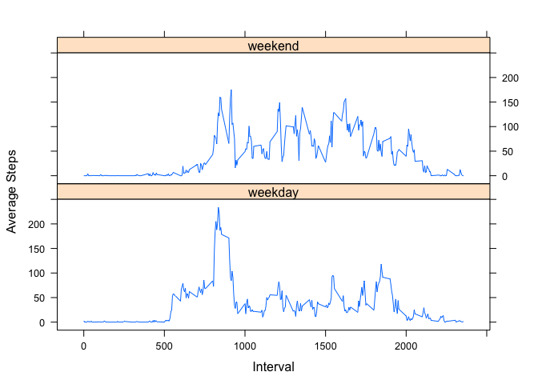

# Reproducible Research: Peer Assessment 1


## Loading and preprocessing the data
Requirements to run this analysis: 
- The working directory is set to where you want to run the analysis
- The lattice and plyr packages are installed on your local system

After the working directory has been set, dependencies are checked and loaded.


```r
  require("lattice")
```

```
## Loading required package: lattice
```

```r
  require("plyr")
```

```
## Loading required package: plyr
```

```r
  library(plyr)
  library(lattice)
```

### 1. Load the data

If not already available, the raw data should be downloaded an unzipped in the working directory. 


```r
  if (!file.exists("activity.zip")) {
    download.file("http://d396qusza40orc.cloudfront.net/repdata%2Fdata%2Factivity.zip", 
      destfile="activity.zip", method="curl")
  }
  
  if (!file.exists("activity.csv")) {
    unzip("activity.zip")
  }
```

The data can then be read in to a data.frame. 


```r
  activity <- read.csv("activity.csv", stringsAsFactors=FALSE)
  summary(activity)
```

```
##      steps           date              interval   
##  Min.   :  0.0   Length:17568       Min.   :   0  
##  1st Qu.:  0.0   Class :character   1st Qu.: 589  
##  Median :  0.0   Mode  :character   Median :1178  
##  Mean   : 37.4                      Mean   :1178  
##  3rd Qu.: 12.0                      3rd Qu.:1766  
##  Max.   :806.0                      Max.   :2355  
##  NA's   :2304
```

### 2. Clean the data if necessary

The above summary indicated that the variable "date" was of the class "character". We need to coerce the date column into the standard Date format. 


```r
  activity$date <- as.Date(activity$date)
  summary(activity)
```

```
##      steps            date               interval   
##  Min.   :  0.0   Min.   :2012-10-01   Min.   :   0  
##  1st Qu.:  0.0   1st Qu.:2012-10-16   1st Qu.: 589  
##  Median :  0.0   Median :2012-10-31   Median :1178  
##  Mean   : 37.4   Mean   :2012-10-31   Mean   :1178  
##  3rd Qu.: 12.0   3rd Qu.:2012-11-15   3rd Qu.:1766  
##  Max.   :806.0   Max.   :2012-11-30   Max.   :2355  
##  NA's   :2304
```


## What is mean total number of steps taken per day?
### 1. Make a histogram of the total steps taken each day

Creat a new data frame(tstep) containing the sum of steps for each day. 


```r
  tstep <- ddply(activity, ~ date, summarise, totalsteps=sum(steps, na.rm=TRUE))
  summary(tstep)
```

```
##       date              totalsteps   
##  Min.   :2012-10-01   Min.   :    0  
##  1st Qu.:2012-10-16   1st Qu.: 6778  
##  Median :2012-10-31   Median :10395  
##  Mean   :2012-10-31   Mean   : 9354  
##  3rd Qu.:2012-11-15   3rd Qu.:12811  
##  Max.   :2012-11-30   Max.   :21194
```

Plot a histogram of the total steps. 


```r
   hist(tstep$totalsteps, breaks=12, main="Histogram of Total Steps", xlab="Total Steps", ylab="Frequency")
```

 

### 2. Calculate and report the mean and median

Calculated directly from the tstep data frame. 

```r
  median(tstep$totalsteps)
```

```
## [1] 10395
```

```r
  mean(tstep$totalsteps)
```

```
## [1] 9354
```


## What is the average daily activity pattern?
### 1. Make a time series plot of average steps taken vs. interval 

To plot this graph, the mean steps accross each interval are first summarized using plyr and then plotted. 


```r
  istep <- ddply(activity, ~ interval, summarise, meansteps=mean(steps, na.rm=TRUE))
  summary(istep)
```

```
##     interval      meansteps     
##  Min.   :   0   Min.   :  0.00  
##  1st Qu.: 589   1st Qu.:  2.49  
##  Median :1178   Median : 34.11  
##  Mean   :1178   Mean   : 37.38  
##  3rd Qu.:1766   3rd Qu.: 52.83  
##  Max.   :2355   Max.   :206.17
```

```r
  plot(istep$interval, istep$meansteps, type="l", main="", xlab="Interval", ylab="Average Steps")
```

 

### 2. Which 5-minute interval has the highest average number of steps? 

We simply find the maximum value in the meansteps column and print the interval. 


```r
  maxMeanSteps <- istep[which.max(istep$meansteps), ]
  maxMeanSteps$interval
```

```
## [1] 835
```


## Imputing missing values
### 1. Calculate and report the total number of missing values in the data set. 


```r
  missingValues <- sum(is.na(activity$steps))
  missingValues
```

```
## [1] 2304
```

### 2. Strategy to fill in missing values

A simple strategy to impute missing values is to insert the mean for each 5 minute interval. First the mean for each interval is calculated over all days.  Then that mean is applied to each missing value using "ddply". 


```r
  impute.mean <- function(x) replace(x, is.na(x), mean(x, na.rm=TRUE))
  iactivity <- ddply(activity, ~ interval, transform, steps = impute.mean(steps))
```

### 3. Create a new data set with the missing values filled in

The "iactivity"" data frame was created above with the missing data filled in. 


```r
  summary(iactivity)
```

```
##      steps            date               interval   
##  Min.   :  0.0   Min.   :2012-10-01   Min.   :   0  
##  1st Qu.:  0.0   1st Qu.:2012-10-16   1st Qu.: 589  
##  Median :  0.0   Median :2012-10-31   Median :1178  
##  Mean   : 37.4   Mean   :2012-10-31   Mean   :1178  
##  3rd Qu.: 27.0   3rd Qu.:2012-11-15   3rd Qu.:1766  
##  Max.   :806.0   Max.   :2012-11-30   Max.   :2355
```

### 4. Create a histogram and calculate the mean and median of the imputed data

We repeat the steps to plot a histogram and calculate mean and median on the imputed data set. 

First create a new data frame with the total steps for each day. 


```r
  tstep2 <- ddply(iactivity, ~ date, summarise, totalsteps=sum(steps, na.rm=TRUE))
  summary(tstep2)
```

```
##       date              totalsteps   
##  Min.   :2012-10-01   Min.   :   41  
##  1st Qu.:2012-10-16   1st Qu.: 9819  
##  Median :2012-10-31   Median :10766  
##  Mean   :2012-10-31   Mean   :10766  
##  3rd Qu.:2012-11-15   3rd Qu.:12811  
##  Max.   :2012-11-30   Max.   :21194
```

Plot a histogram for the imputed totals


```r
  hist(tstep2$totalsteps, breaks=12, main="Total Steps of Imputed Data", xlab="Total Steps", ylab="Frequency")
```

 

Calculate the mean and median. 

```r
  median(tstep2$totalsteps)
```

```
## [1] 10766
```

```r
  mean(tstep2$totalsteps)  
```

```
## [1] 10766
```
#### 4.1 Do the values differ from those above? 

There are small differences between the mean and median from those above. This is because we used the mean value of each interval to impute missing values in each interval. There were approximatly 2000 NA values converted to the mean of each interval.  This resulted in the mean and meadian being slightly higher than with the NAs and they are now both equal.

#### 4.2 What effect does imputing have?

The imputing method used should not have much effect on the overall data. As demonstrated in the histogram above, the frequency around the central tendency increased with the imputed data. With that the data tended to resemble more of a normal distribution. 


## Are there differences in activity patterns between weekdays and weekends?
### 1. Create a new factor variable for weekends and weekdays
The original "activity" data frame was used for this analysis.
First a boolean factor was created and then the boolean values mapped to "weekend" or "weekday". 

```r
  activity$daytype <- weekdays(activity$date) %in% c("Saturday", "Sunday")
  activity$daytype <- mapvalues(activity$daytype, from=c(TRUE, FALSE), to=c("weekend", "weekday"))
  head(activity)
```

```
##   steps       date interval daytype
## 1    NA 2012-10-01        0 weekday
## 2    NA 2012-10-01        5 weekday
## 3    NA 2012-10-01       10 weekday
## 4    NA 2012-10-01       15 weekday
## 5    NA 2012-10-01       20 weekday
## 6    NA 2012-10-01       25 weekday
```

### 2. Make a plot for average steps per interval for weekends and weekdays

The mean steps for each time interval were calculated separately for weekends and weekdays. 

This was done by creating separate data frames for weekends and weekdays and then assigning the mean value to each interval using plyr. 


```r
  weekdays <- activity[activity$daytype == "weekday", ]
  iweekdays <- ddply(weekdays, ~ interval, summarise, meansteps=mean(steps, na.rm=TRUE))
  iweekdays$daytype <- "weekday"
  
  weekends <- activity[activity$daytype == "weekend", ]
  iweekends <- ddply(weekends, ~ interval, summarise, meansteps=mean(steps, na.rm=TRUE))
  iweekends$daytype <- "weekend"
```

The data frames are bound back together. 


```r
  #bind the two data frames back together
  week <- rbind(iweekends, iweekdays)
  summary(week)
```

```
##     interval      meansteps        daytype         
##  Min.   :   0   Min.   :  0.00   Length:576        
##  1st Qu.: 589   1st Qu.:  1.85   Class :character  
##  Median :1178   Median : 26.29   Mode  :character  
##  Mean   :1178   Mean   : 39.21                     
##  3rd Qu.:1766   3rd Qu.: 62.32                     
##  Max.   :2355   Max.   :234.10
```

The lattice plotting system was used to create a multipanel plot to compare weekend and weekday activity. 


```r
  xyplot(meansteps ~ interval | daytype, data=week, type="l", main="", xlab="Interval", ylab="Average Steps")
```

 

There appears to be differences in behaviour between weekdays and weekends.

On weekdays, people are more active in the mornings and sedentary for the day. Activity is more consistent and higher throughout the day on weekends. This is consistent with people travelling to work in the morning and sitting throughout the day on weekdays while being more active,possibly in recreational activites, on the weekends. 


